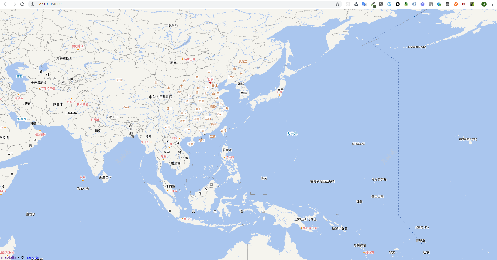

## maptalks.wmts

maptlkas 加载 wmts 服务实现

## 项目结构说明
```javascript
|-- maptalks.wmts
    |-- .gitignore
    |-- README.md
    |-- demo - npm 包 maptalks.wmts 使用示例
    |   |-- index.html
    |   |-- package.json
    |   |-- webpack.config.js - 示例配置文件
    |   |-- yarn.lock
    |   |-- dist
    |   |   |-- main.js - 示例打包输出文件
    |   |-- src
    |       |-- index.js - 示例入口文件(核心代码)
    |-- maptalks.wmts.npm - npm 包文件，核心内容 maptalks.wmts.js 由 sourceCode 源代码打包而来
    |   |-- index.js
    |   |-- lib
    |       |-- maptalks.wmts.js
    |-- sourceCode
        |-- package.json
        |-- webpack.config.js
        |-- yarn.lock
        |-- src
            |-- index.js - maptalks 加载 wmts 服务的源码
```

注意maptalks 加载 wmts 服务的源码不是本人写的而是参考大神 [lifefriend/maptalks-demo](https://github.com/lifefriend/maptalks-demo),方便在我的场景下使用才发布成 npm 包的，感谢大佬分享

## demo 运行

### 核心命令
```shell
$ cd demo
$ yarn install
$ yarn build
$ yarn live
```

### 运行结果预览



## maptalks.wmts 包使用

```shell
$ yarn add maptalks.wmts
或
$ npm install maptalks.wmts -dev-save
```


`核心代码 - es module 版本`

```javascript
import { WMTSTileLayer } from 'maptalks.wmts'

new WMTSTileLayer('layer', {
    tileSystem: [1, -1, -180, 90],
	layer: 'vec',
	tilematrixset: 'c',
	format: 'tiles',
	urlTemplate: 'http://t{s}.tianditu.com/vec_c/wmts?tk=34e168d12e2b79f61dc1e6e220659c71',
	subdomains: ['1', '2', '3', '4', '5'],
	attribution: '&copy; <a target="_blank" href="http://www.tianditu.cn">Tianditu</a>'
}),

new WMTSTileLayer(id, options),

```
`其它调用方式也支持具体代码待补充`

## 当前版本中的 bug

+ 当 options 参数为引用类型时存在 库代码修改外部参数的情况 - 别人使用遇到反馈给我的，自己还没来得及重现和修改，如果要使用且 options 参数传入的是另一个引用类型记得深拷贝这个 options 参数给一个中间量防止出现错误(我会尽量快点找时间解决的)
